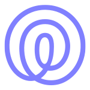

# ioBroker.life360ng



[](https://www.npmjs.com/package/iobroker.life360ng)
[](https://www.npmjs.com/package/iobroker.life360ng)

## Life360 adapter for ioBroker (next generation)

An unofficial ioBroker adapter for [Life360](https://www.life360.com) — updated for EU users with modern token-based authentication.

> **Disclaimer:** This is an unofficial, community-developed adapter. It is not affiliated with or endorsed by Life360, Inc. Provided free of charge for personal, non-commercial home automation use. Use at your own risk. Life360 may disable or change their API at any time without notice.

## Description

This adapter connects to the [Life360](https://www.life360.com) cloud services to track people and detect presence at defined places. It retrieves circles, members and places data and persists it as ioBroker states, updated at a configurable interval.

## Installation

Install the adapter in ioBroker Admin via a custom URL:
`https://github.com/inventwo/ioBroker.life360ng`

Or on the command line:

```bash
iobroker npm install inventwo/iobroker.life360ng --loglevel error --prefix "/opt/iobroker"
```

## Configuration

### Bearer Token (required for EU users)

Life360 has disabled password-based login for EU users. Obtain a Bearer token manually:

1. Open [https://life360.com/login](https://life360.com/login) in your browser.
2. Enter your email address and click **Continue**.
3. Enter the one-time code sent to your email.
4. Open browser DevTools (**F12**) and switch to the **Network** tab.
5. Find the **POST** request named `token` (ignore OPTIONS).
6. In **Preview** / **Response**, copy the value of `access_token`.
7. Paste it into the **Bearer token** field in the adapter configuration.

**Note:** Tokens are long-lived (typically months). When expired, the adapter log will show a connection error — repeat the steps above to get a new token.

### My Places

Add private places not visible to Life360 cloud services. The adapter checks presence at your custom places on every poll.

- Define a **Name** for the place.
- Set the geo-position (latitude and longitude).
- Set the radius in meters.

### Integration

Choose which Life360 data to process: circles, places, people. Optionally forward location data to the ioBroker [Places-adapter](https://github.com/ioBroker/ioBroker.places).

### Location-Tracking

Enable location-tracking to add geo-positioning details (latitude, longitude, `locationName`) to the people data points.

## States

| State | Description |
|---|---|
| `people.<name>.locationName` | Current Life360 place name (e.g. Home) |
| `people.<name>.location` | Geo-position object |
| `info.connection` | `true` when connected to Life360 cloud |

## Changelog

<!--
  Placeholder for the next version (at the beginning of the line):
  ### **WORK IN PROGRESS**
-->
### 1.0.0 (2026-04-10)

- (skvarel) Fork from ioBroker.life360, renamed to life360ng
- (skvarel) Switched to token-only authentication (removed password/phone login)
- (skvarel) Fixed EU API connectivity (TLS cipher fix, v3 endpoints for members and places)
- (skvarel) Added `locationName` state
- (skvarel) Removed unused phone/password/countryCode config fields

## License

MIT License

Copyright (c) 2026 skvarel <sk@inventwo.com>

Permission is hereby granted, free of charge, to any person obtaining a copy
of this software and associated documentation files (the "Software"), to deal
in the Software without restriction, including without limitation the rights
to use, copy, modify, merge, publish, distribute, sublicense, and/or sell
copies of the Software, and to permit persons to whom the Software is
furnished to do so, subject to the following conditions:

The above copyright notice and this permission notice shall be included in all
copies or substantial portions of the Software.

THE SOFTWARE IS PROVIDED "AS IS", WITHOUT WARRANTY OF ANY KIND, EXPRESS OR
IMPLIED, INCLUDING BUT NOT LIMITED TO THE WARRANTIES OF MERCHANTABILITY,
FITNESS FOR A PARTICULAR PURPOSE AND NONINFRINGEMENT. IN NO EVENT SHALL THE
AUTHORS OR COPYRIGHT HOLDERS BE LIABLE FOR ANY CLAIM, DAMAGES OR OTHER
LIABILITY, WHETHER IN AN ACTION OF CONTRACT, TORT OR OTHERWISE, ARISING FROM,
OUT OF OR IN CONNECTION WITH THE SOFTWARE OR THE USE OR OTHER DEALINGS IN THE
SOFTWARE.
